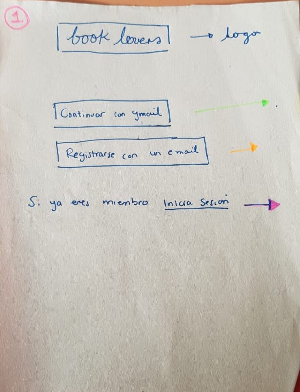
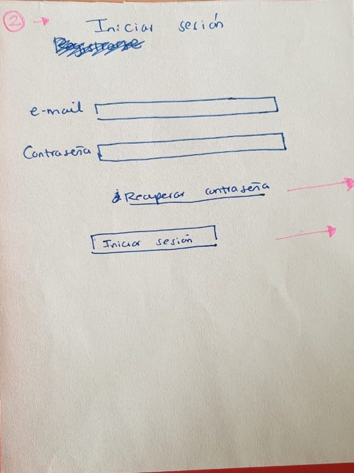
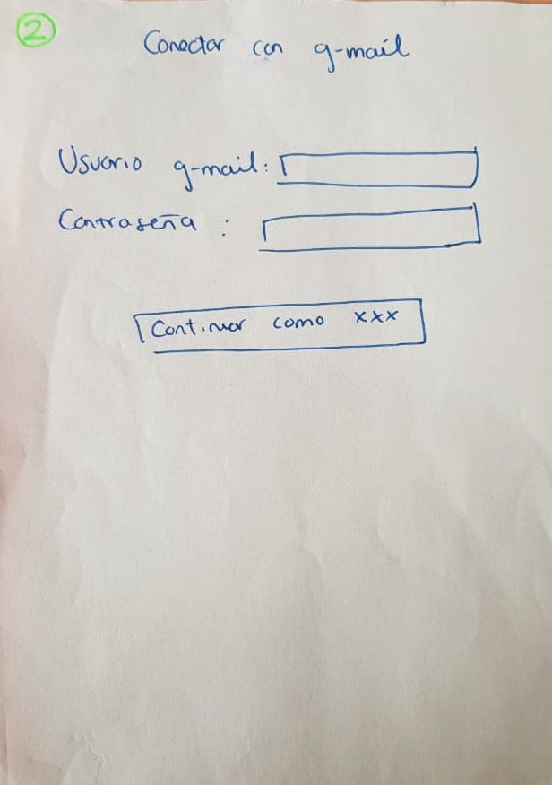
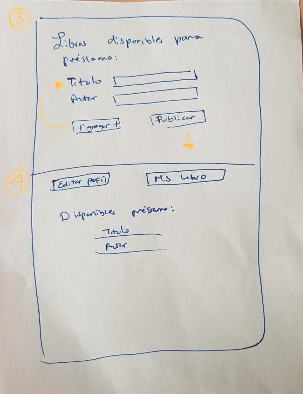
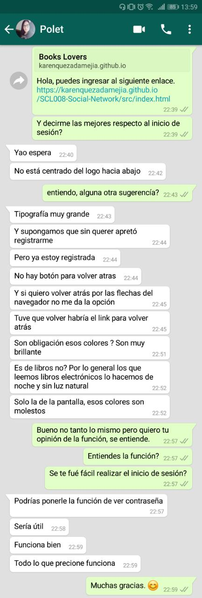
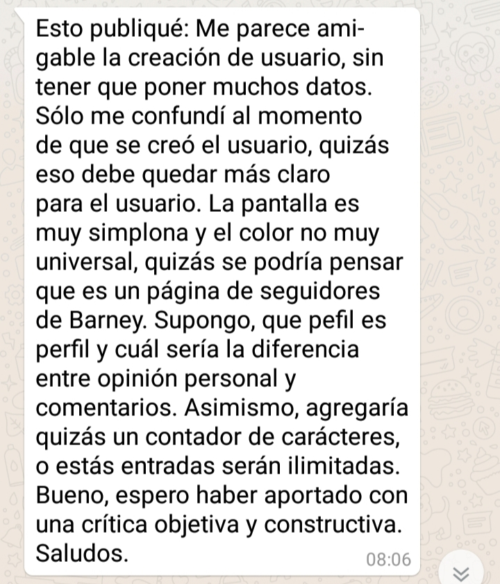

## Introducción
    
Vivimos en un mundo dinámico, en donde el estilo de vida incluye viajes recurrentes, mudanzas y más. Sin embargo, aunque el mundo cambia constantemente, los amantes de la lectura siguen siendo un gran cantidad y apesar de la aparición de los libros digitales,el placer de tener en las manos un libro físico permanece. Por otra parte es cierto que los libros físicos son más caros y lamentablemente ocupan espacio que desafortunadamente cada día es más dificil de tener y mantener en el tiempo.

Por suerte, en la actualidad las personas están más dispuestas a compartir ó intercambiar sus pertenecias y añadiendo la técnología a la ecuación, las aplicaciones facilitan rl contacto con gente con nuestros mismos gustos e intereses.

***

## Books Lovers

Es un aplicación que esta dirigida principalmente a amantes de los libros y la lectura en general, para ponerse en contacto con personas con la misma fascinación por leer, un espacio donde poder compartir opiniones de lecturas, titulos y autores con el objetivo de intercambiar los libros que tienen "guardados",ademas de opiniones libros físicos y digitales.

De esta manera les brindamos una herramienta para conocer lectores y crear circulos para interactuar . Por ejemplo: Si un usuario ya leyo un libro y publica un comentario positivo del texto, y a otro usuario le interesa pueden intercambiar según sus gustos de lectura.

## Ideas de Diseño:

* Para definir el diseño de nuestra Red Social comenzamos a revisar la interfaz de usuario de distintas redes sociales como Facebook, Twitter Instagram, además de redes sociales con tematicas parecidas a la idea.

### Encuesta
Se realizó una encuesta por medio de google forms donde participaron 50 personas, aficionados a la lectura, con el fin de indagar acerca de lo que les interesaria ver en una red social para lectores.

Se les realizaron preguntas como:
1.- ¿Qué información es relevante  para ti conocerde de un libro? 
2.-¿Qué haces con los libros fisicos que no estas usando?
3.-¿Estarías dispuesto a prestar tus libros en desuso?

Debido a que nos dimos cuenta que la mayoría de los lectores no les da un uso productivo a sus libros después de leerlos y que además tienen un problema de acumulación de libros. Nos resultó mas evidente la necesidad de crear esta red social en donde se de un espacio para publicar los libros que se tienen disponible para intercambio y donde el usuario también pueda buscar libros de su interés para pedir préstado, esto solucionaría el problema de acumulación de libros, ayuda en la economia del lector sin tener que renunciar al placer de leer un libro físico. Es importante mencionar que tampoco dejamos de lado el libro dígital, estos también podrían ser compartidos en la red social.

 ### Prototipado baja fidelidad

 El paso siguiente corresponde al prototipado de baja definición, es decir la idea iniacial de como queremos que se vea nuestra aplicación. Aquí comenzamos iterando sobre cómo debería ser, y qué elementos debería contener para llegar al producto final.

Concretando ideas llegamos a un prototipo inicial de 4 pantallas.

La primera es donde el puede seleccionar las opciones disponibles para iniciar sesión, que puede ser con una cuenta creada desde la aplicación o mediante su cuenta de Gmail, en caso que no este registrado, hay un link que dice "registrate aquí".

La segunda es la pantalla donde puede ingresar sus datos y crear su cuenta con clave o bien donde inicias sesión con gmail, depende de la opción elegida en la primer pantalla.

La tercera es donde el usuario puede crear post de los libros que tiene disponibles.

La cuarta  es la página principal o muro de nuestra red social, donde se pueden ver las publicaciones de otros usuarios.

En estas imagen se muestra el inicio de nuestra aplicación.

#### Prototipo de alta fidelidad
Prototipo en Figma
Despues de un feedback inicial, se modifico el diseño a uno más optimo que se puede observar en alta definición, en el link de abajo.

[Selecciona aqui](https://www.figma.com/file/NgitjUhqvmZXmFgL9oQgtrkX/Social-Network?node-id=2%3A7)

## Planificación
Realizamos una planificación al comienzo del proyecto con tableros en la pizarra. Utilizamos Trello para digitalizar nuestra planificación. 

[Selecciona aqui](https://trello.com/b/TcVVuZ6t/red-social-book-lovers)

#### Testeos de usabilidad

En esta sección estan incluidas algunas de las entrevistas realizadas durante el testeo de nuestra aplicación.

[Entrevista a Victor Hugo,29 años ](https://www.loom.com/share/780506c4744a4fbd96cc8351c89052b0)

Entrevista a Polette, 26 años

Entrevista a Patricio, 55 años

 

#### Conclusiones de mejoras 

Acontinuación se enlistan los aspectos a mejorar que fueron detectados y que ya fueron mejorados en la aplicación:

1. El color es demasiado brillante, debería ser más amigable especialmente si es dirigido a lectores.
2. En el momento del registro, el usuario no tenía claro si había sido un registro exitoso por lo que se debería añadir un mensaje indicandole que su registro fue exitoso.
3. También, se recomendo que al apretar el logo se volviera al inicio, ya que no era claro donde más apretar para volver al inicio.

## Herramientas utilizadas:

* Javascript
* CSS
* HTML
* Firebase
* Git Hub
* Figma

Este trabajo se desarrolla para el Bootcamp de Laboratoria. Desafío Social-Network.

Betsi Salas
Karen Quezada
Stephanie Mayen

[Deploy ](https://karenquezadamejia.github.io/SCL008-Social-Network/src/index.html)